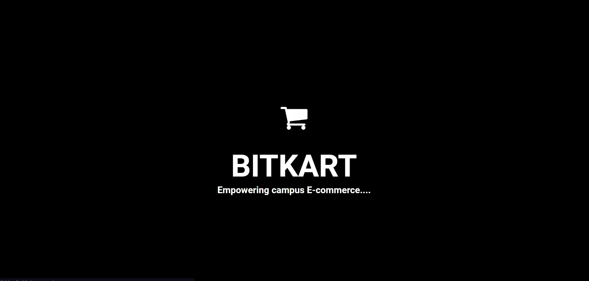
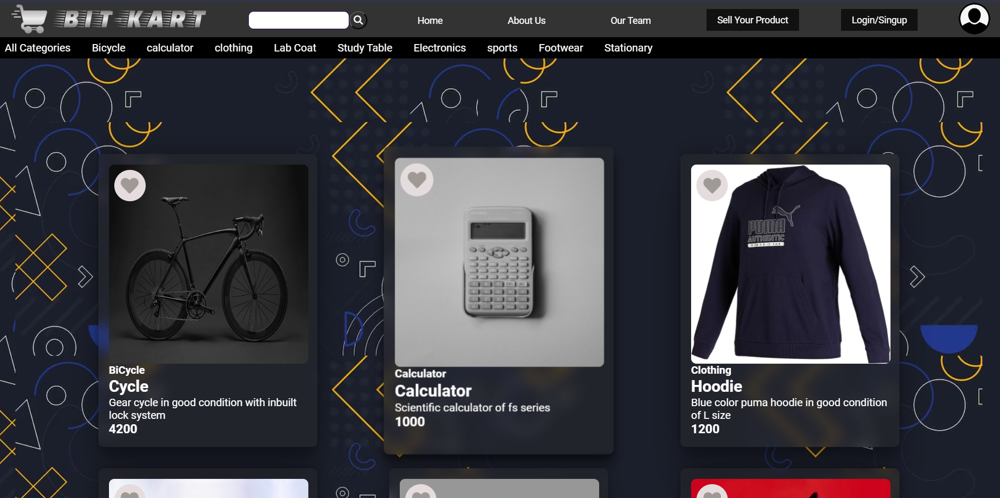
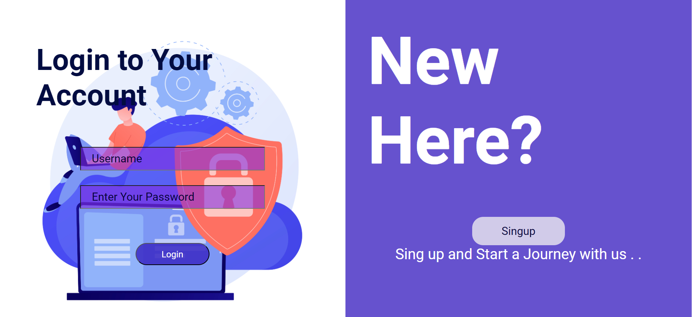
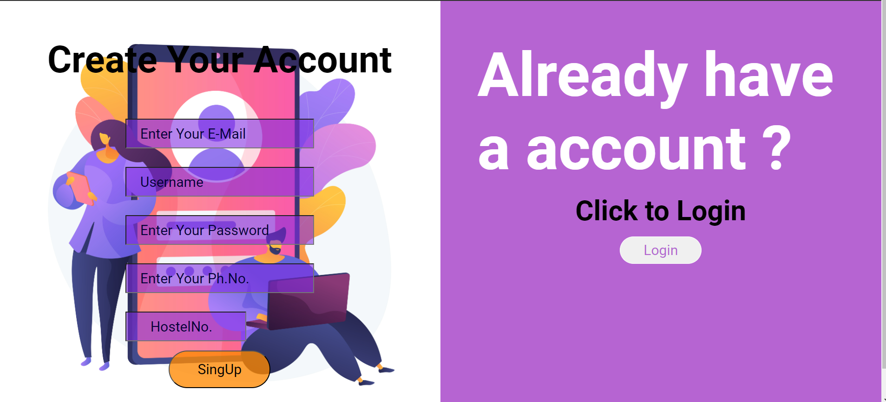
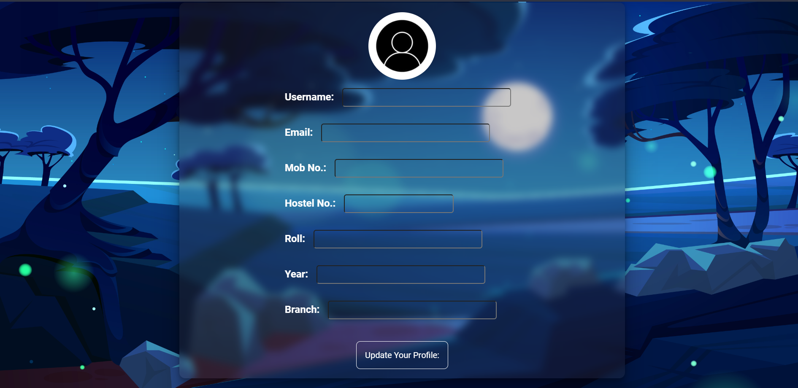
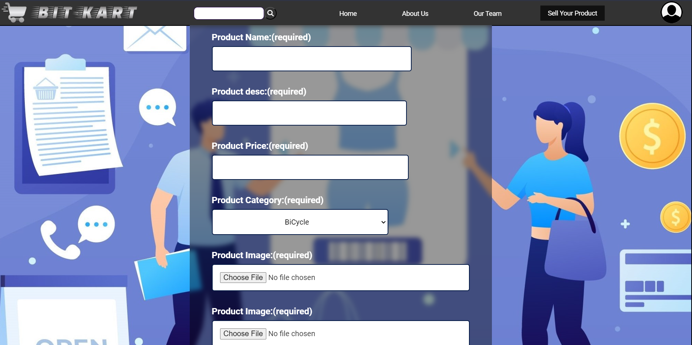

# BIT-KART: Empowering Campus E-commerce
BIT-KART is an innovative web development project that introduces a dynamic online platform tailored for the buying and selling of second-hand goods within a college campus. This platform is designed to foster a sense of community, sustainability, and convenience among students by providing a seamless and secure way to exchange pre-owned items.

# Team Details
- **Team Name:**  BITKART
- **Team Members:**
  - RITIK RAJ  `Mern Stack dev`
  - SAKET NAYAN  `Frontend dev`
  - NIKHIL SINGH  `Frontend dev`

## Domain
   WEBDEVELOPMENT

## Tech Stack Used
- FRONTEND - `HTML` `CSS` `JAVASCRIPT` `REACT`
- BACKEND  - `NODE.JS`  `EXPRESS.JS` 
- DATABASE - `MONGODB`


# Achievement So Far
## MERN Stack Implementation:
Successfully developed a full-stack web application using the MERN (MongoDB, Express.js, React, Node.js) stack, ensuring a seamless and integrated user experience.

## Secure Authentication:
Implemented JWT-based authentication to ensure secure and private user logins, enhancing the overall website's security.

## MongoDB Integration:
Integrated MongoDB as the database management system, providing a scalable and efficient solution for user signup, login, and product management.

## Efficient Image Uploads:
Utilized Multer for image uploads, allowing users to seamlessly add images to their product listings, enhancing the visual appeal of the listings.

## RESTful Routes:
Established RESTful routes for key functionalities such as user registration, login, and product management, ensuring a standardized and organized API structure.

## Cross-Origin Request Handling:
Integrated CORS middleware to handle cross-origin requests, facilitating smooth communication between the frontend and backend components.

## Request Body Parsing:
Implemented body-parser for efficient parsing of request bodies, optimizing data handling and communication between the client and server.

## Dynamic and Responsive Frontend:
Designed a dynamic and responsive frontend using React, enhancing user interaction and experience across various devices.

## Product Details Page:
Created a detailed product details page where users can view comprehensive information about a particular item, fostering transparency in second-hand transactions.

## Seller Details and Contact Integration:
Implemented a feature for users to view seller details and seamlessly contact them through WhatsApp , enhancing communication and trust between buyers and sellers.

## User Registration and Login System:
Developed a user-friendly signup and login system, requiring users to authenticate before accessing detailed product information, ensuring privacy and security.

## User Profile Update:
Implemented a user-friendly profile update feature, allowing users to modify and update their personal information after the initial signup, enhancing the overall user experience and personalization of profiles.

#  Executing  Code

To run the BIT-KART project locally, follow these steps:

1. Clone the repository:

2. Navigate to the project directory:

    ```bash
    cd bit-kart
    ```

3. Navigate to api(backend) directory:

    ```bash
     cd api
    ```
4. Install dependencies:

    ```bash
    npm i body-parser cors express jsonwebtoken mongoose nodemon
    ```   
5. Start the backend server:

    ```bash
    npm run dev
    ```
6. Navigate to client(frontend) directory:

    ```bash
     cd ../client/
    ```   
7. Install dependencies:

    ```bash
    npm install
    ```      
8. Start the backend server:

    ```bash
    npm start
    ```
    Visit [http://localhost:3000](http://localhost:3000) in your browser to access the BIT-KART platform locally.


## Link to Hosted Website  [here](https://main--bitkart.netlify.app/)
   
   
   
   
   
   
   

