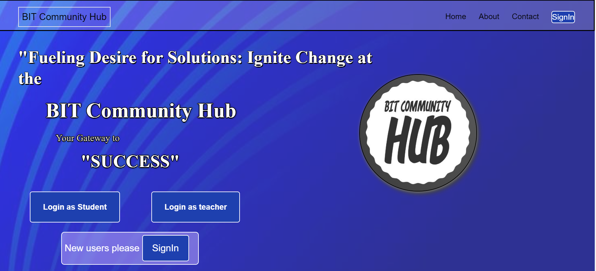
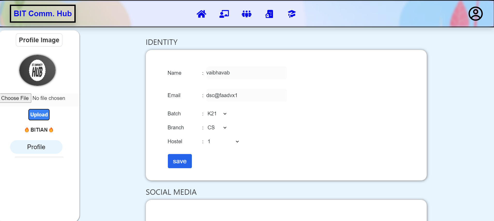
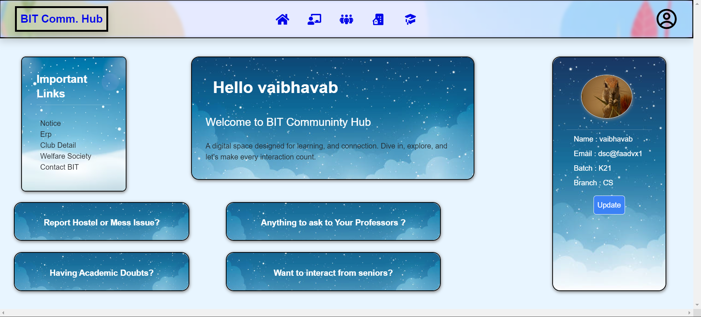
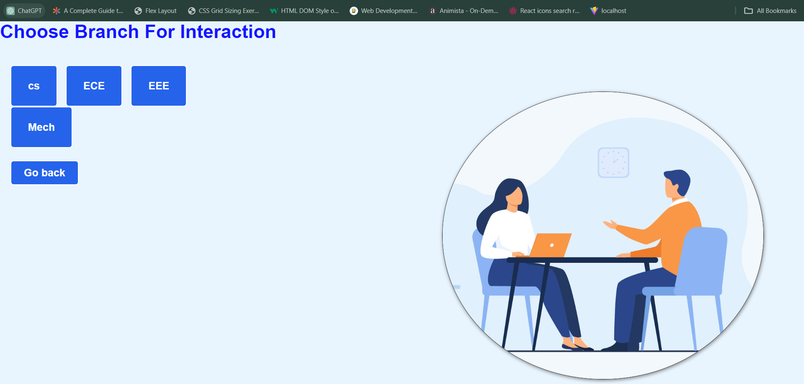
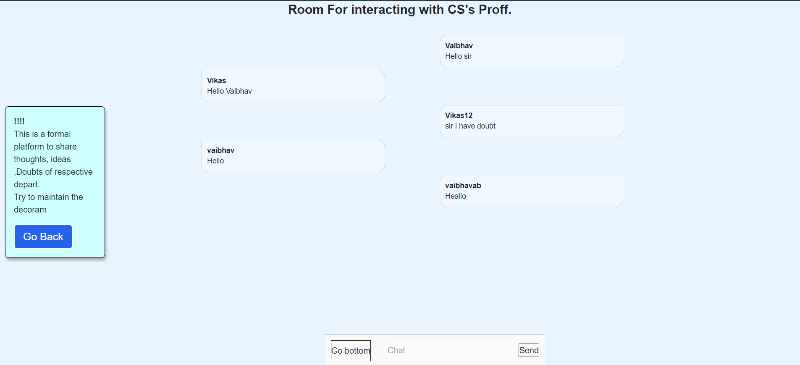
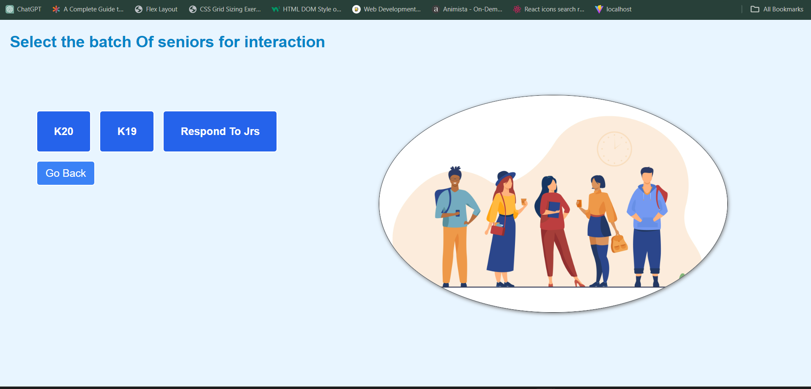
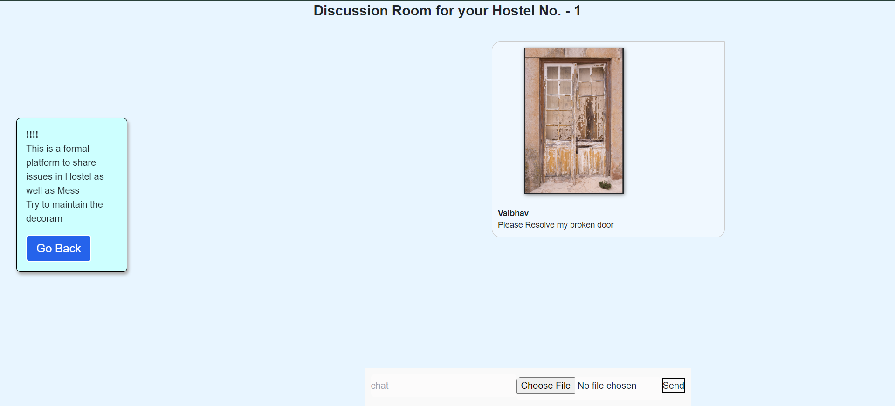
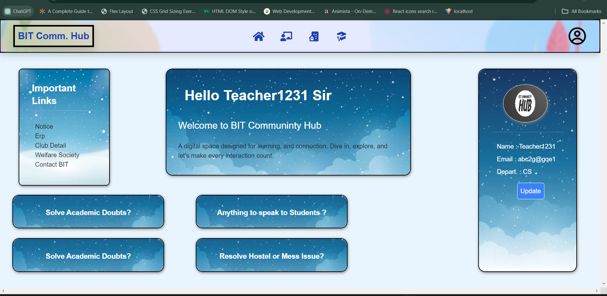

## BIT COMMUNITY HUB: Connecting BIT

The project is an inclusive online platform for students and teachers at BIT. It features a secure login, personalized dashboard, and sections like Doubt, Academic, and Hotel Issues for seamless engagement. Real-time Interaction with Professors and Seniors fosters communication through text, video, and mentorship. The user-friendly design emphasizes scalability, security, feedback mechanisms, accessibility, and regular maintenance, ensuring a dynamic and supportive academic community at BIT. Domain-independent considerations include scalability, security, feedback mechanisms, accessibility standards, and a maintenance plan for ongoing updates and improvements, ensuring the longevity and effectiveness of the BIT Community Hub.

## Team Details

- _Team Name:_ TEEN TIGDI
- _Team Members:_

  - Vaibhav kr. Gupta Mern Stack dev (Backend + Frontend)

  - Raja Rajak
  - Anurag Baranwal

## Domain

WEB DEVELOPMENT

## Tech Stack Used

- FRONTEND - HTML, CSS, JAVASCRIPT, REACT
- BACKEND - NODE.JS , EXPRESS.JS
- DATABASE - MONGODB

## Achievement So Far

# MERN Stack Implementation:

Effectively created a comprehensive web application employing the MERN (MongoDB, Express.js, React, Node.js) stack, guaranteeing a smooth and cohesive user interaction.

# MongoDB Integration:

Integrated MongoDB as the database management system, providing a scalable and efficient solution for user signup, login, and product management.

# Efficient Image Uploads:

Utilized Multer for image uploads, allowing users to seamlessly add images to their product listings, enhancing the visual appeal of the listings.

# RESTful Routes:

Established RESTful routes for key functionalities such as user registration, login, and product management, ensuring a standardized and organized API structure.

# Cross-Origin Request Handling:

Integrated CORS middleware to handle cross-origin requests, facilitating smooth communication between the frontend and backend components.

# Request Body Parsing:

Implemented body-parser for efficient parsing of request bodies, optimizing data handling and communication between the client and server.

# Key Features

## Secure Login:

# Implements robust authentication measures to ensure the confidentiality of user data.

    Personalized Dashboard:

    Tailors the user experience based on individual preferences and needs.

## Sections:

# Doubt:

    Dedicated space for addressing queries and concerns, fostering a collaborative learning environment.

## Academic:

    Central hub for academic resources, announcements, and information sharing.

## Hotel Issues:

    Platform for discussing and resolving accommodation-related matters, ensuring a holistic support system.
    Real-time Interaction:

## Text Communication:

    Enables instant messaging for quick and efficient communication.
    Video Communication:
    Facilitates face-to-face interactions, promoting a more personal and engaging experience.
    Mentorship:
    Connects students with professors and seniors for mentorship opportunities, encouraging knowledge transfer and personal growth.

## User Profile Update:

## Implemented a user-friendly profile update feature, allowing users to modify and update their personal information and photo after the initial signup, enhancing the overall user experience and personalization of profiles.

## Executing Code

To run the BIT-KART project locally, follow these steps:

1. Clone the repository:

2. Navigate to api(backend) directory:

   bash
   cd backend

3. Install dependencies:

   bash
   npm i body-parser cors express mongoose nodemon

4. Start the backend server:

   bash
   npm run dev

5. Navigate to client(frontend) directory:

   bash
   cd ../Frontend/

6. Install dependencies:

   bash
   npm install

7. Start the backend server:

   bash
   npm run dev

   Visit [http://localhost:3000](http://localhost:3000) For Backend.

### vedio

### Code Sample

## Sample video Link [Click here](https://www.youtube.com/watch?v=RcAM1kb56v8) (Recommended)

## Link to Hosted Website [Click here](https://8fhtzy-5173.csb.app) (may lag)
