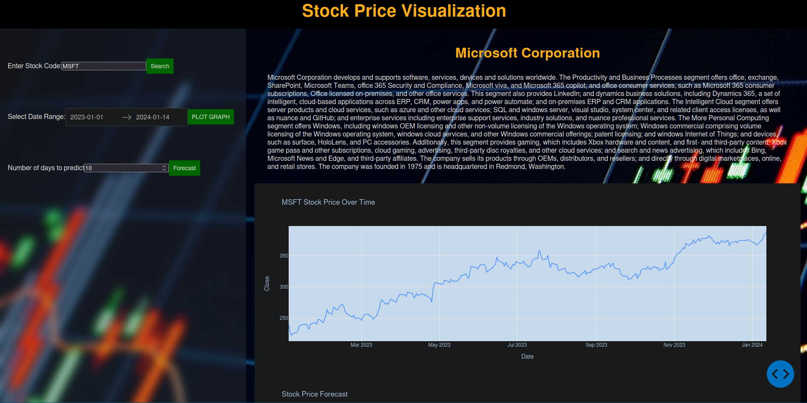
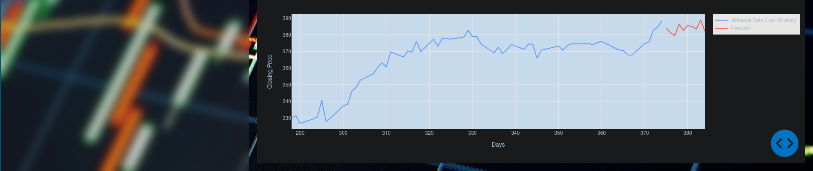

# IEEE MEGA PROJECT 2023

## TEAM
- **TEAM NAME:** CODE SMITHS
- **TEAM MEMBERS:**
  - Saahit Kamu [Brainitech] `backend programmer`
  - Devashish Komiya	`ML model`
  - Nischal	`UI Designer`

## Domain
Machine Learning [LSTM]

## Description
A machine learning framework that can predict and visualise stock investments based on a stock code of a specific company.
This model uses the DASH library  of python to provide the current stock details provided by yfinance python library.

## TECH Stack
- **Language:** `Python`
- **Back-end Tools:** `DASH` `SKLearn`
- **Front-end Tools:** `HTML` `CSS` `FLASK`
- **Refference:** [here](https://www.crio.do/projects/python-forecasting-stocks-dash/?utm_source=crio-blog&utm_medium=imlp)

## Progress
Successfully implemented the idea after a few struggles with the ML model, few shortcuts had to be taken in order to overcome certain bugs with the model. Finalizing the UI design was tricky but thanks to @Nischal we over came it.

## Execute Code
**Prerequisites:**

`Python 3.11>`

`requirements.txt`

- Clone the repo to your local directory
- Create a [venv](https://docs.python.org/3/library/venv.html) and install required libraries. {reffer `requirements.txt`}
- Run `main.py`

## Sample

