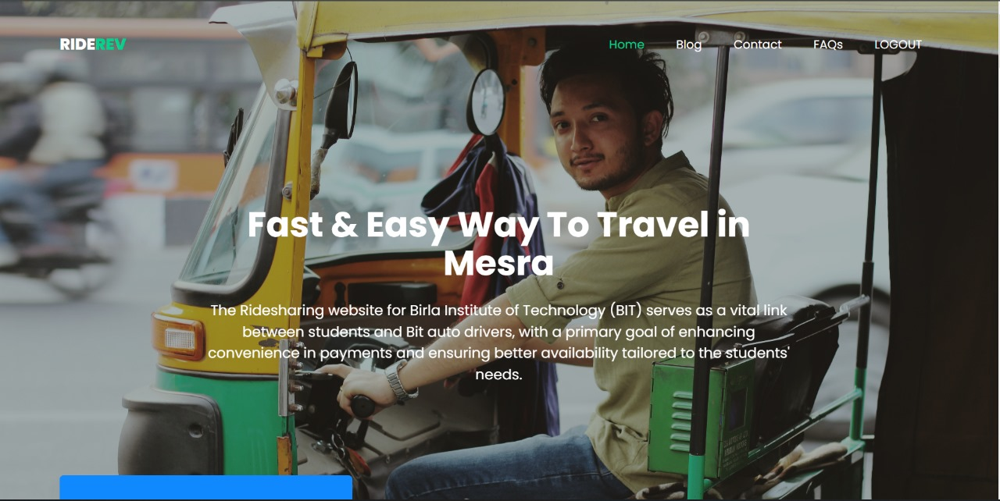
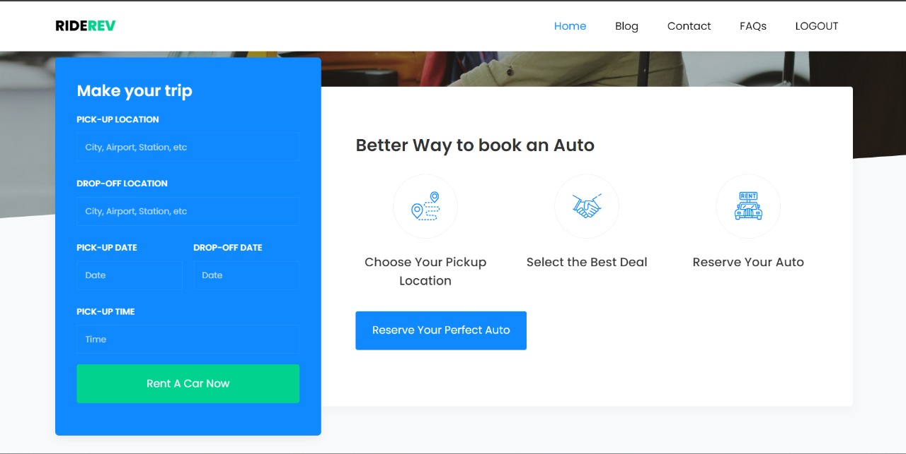
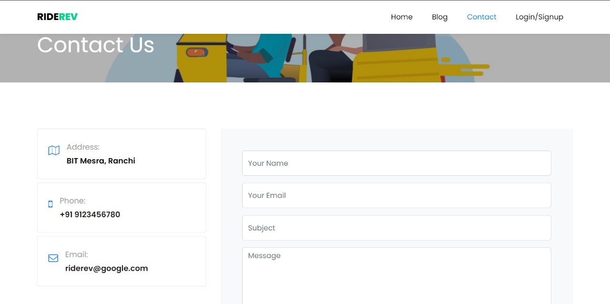
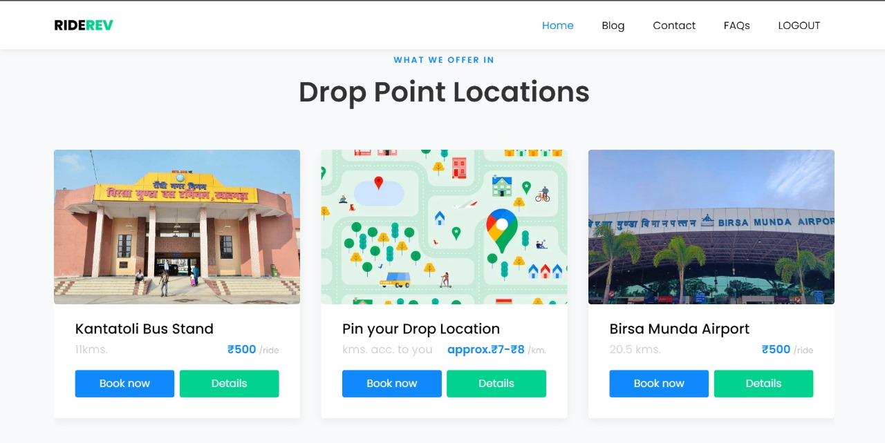
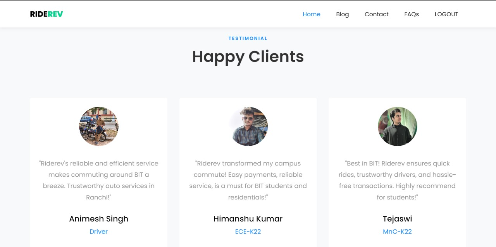

# RIDEREV

RIDEREV is a  Ridesharing website for Birla Institute of Technology (BIT) serves as a vital link between students and Bit auto drivers, with a primary goal of enhancing convenience in payments and ensuring better availability tailored to the students' needs. This innovative platform not only simplifies the transportation process for students but also plays a crucial role in supporting auto drivers by expanding their customer base. By fostering a seamless connection between passengers and drivers, the ridesharing website contributes to a more efficient and accessible transportation system within the BIT community, benefiting both students and auto drivers alike.he campus.
# Team Details
- **Team Name:**  TECHTITANS
- **Team Members:**
  - SAHIL MISHRA  
  - DEBSPANDAN CHAKRABORTY  
  - ABHISHEK KUMAR 

## Domain
   WEBDEVELOPMENT

## Tech Stack Used
- FRONTEND - `HTML` `CSS` `JAVASCRIPT` `EJS`
- BACKEND  - `NODE.JS`  `EXPRESS.JS` 
- DATABASE - `MONGODB`

# Achievement So Far

## MongoDB Integration:
Integrated MongoDB as the database management system, providing a scalable and efficient solution for user signup, login, and product management.

## Efficient Image Uploads:
Image uploads, allowing users to seamlessly add images to their portfolio, enhancing the visual appeal of the listings.

## Dynamic and Responsive Frontend:
Designed a dynamic and responsive frontend using HTML,CSS and JAVASCRIPT, enhancing user interaction and experience across various devices, allowing seamless and efficient navigation through pages.
  
## Driver Details and Contact Integration:
Implemented a feature for users to view driver details and seamlessly contact them through our website , enhancing communication and trust between riders and drivers.

## Better Availability:
Ensures better availability of auto rides, tailored to the needs of students.

## User Registration and Login System:
Developed a user-friendly signup and login system, requiring users to authenticate before accessing detailed product information, ensuring privacy and security.

## User Portfolio:
Implemented a user-friendly portfolio update feature, allowing users to modify and update their personal information after the initial signup, enhancing the overall user experience and personalization of profiles.
## Future Prospects
## Installation

To set up the project locally, follow these steps:

1. Clone the repository to your local machine.

2. Install the necessary dependencies.

3. Start the development server.

4. Access the website locally by navigating to `http://localhost:3000` in your web browser.

## Contributions

We welcome contributions to improve the website and add new features. To contribute, follow these guidelines:

1. Fork the repository and create a new branch from the `master` branch.
2. Make your changes and test thoroughly.
3. Create a pull request, describing the changes you've made.

Please ensure that your code adheres to the project's coding standards, and all new features are well-documented.

Feel free to explore the code, use the website, and provide feedback. Happy riding! 🚀

   
   
   
   
   
   
   
